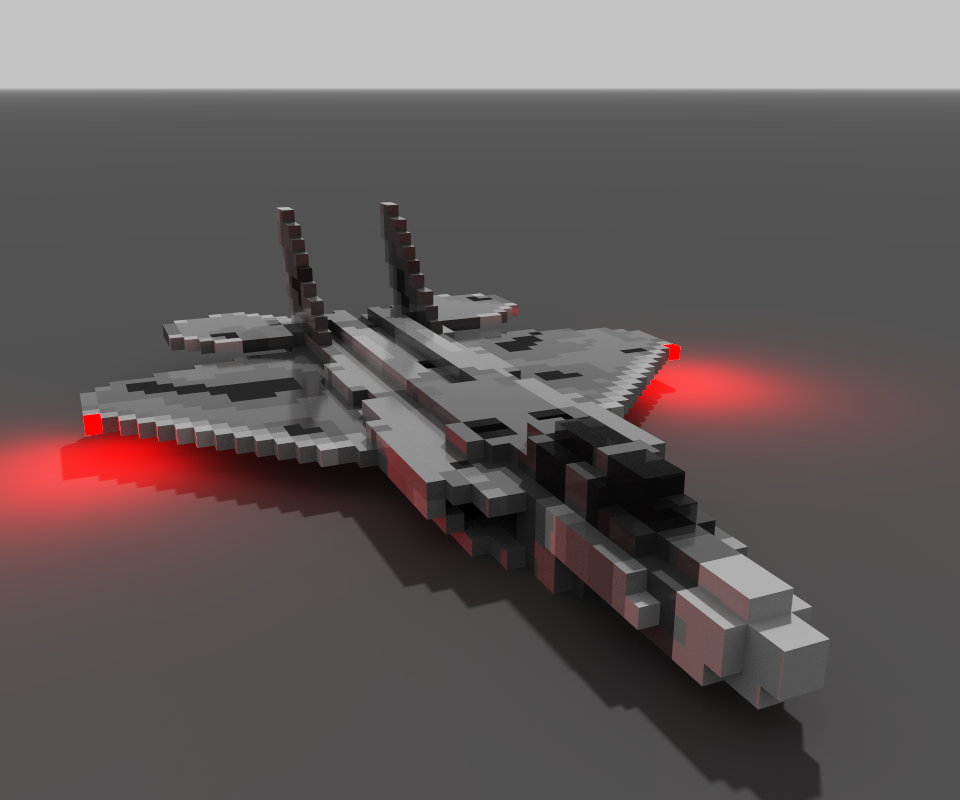

# 🌌 F-22 Raptor Voxel Model Project

Welcome to my project on the F-22 Raptor, modeled in MagicaVoxel and exported for 3D visualization. This repository contains the voxel model, OBJ conversions, renders, and more, showcasing skills in voxel modeling and 3D rendering.

## 📑 Table of Contents
1. [Repository Structure](#-repository-structure)
2. [Project Overview](#-project-overview)
3. [Extensions](#-extensions)
4. [Requirements](#%EF%B8%8F-requirements)
5. [Visuals](#-visuals)
6. [How to Use](#-how-to-use)
7. [Download as .zip](#-download-as-zip)
8. [Contribution](#-contribution)
9. [License](#-license)

---

## 📁 Repository Structure

```
.
├── VOX/                  # Voxel model in .vox and preconfigured render .txt
├── OBJ/                  # Fused OBJ model
├── OBJ-Parts/            # Individual OBJ pieces
├── Render.png            # Render of the F-22 Raptor
.
```

## 🚀 Project Overview

The F-22 Raptor is a stealth fighter aircraft modeled in MagicaVoxel with a voxel-based approach. This project focuses on:

- Creating a detailed voxel model using MagicaVoxel.
- Exporting the model to OBJ format for broader compatibility.
- Generating a high-quality render of the aircraft.

## Extensions

(`.vox`, `.txt`, `.obj`, `.png`)

## 📋 Requirements

To use the files:

- **MagicaVoxel**: For `.vox` files (latest version recommended).
- **Text Editor**: For `.txt` render configuration (e.g., Notepad++).
- **3D Software**: For `.obj` files (e.g., Blender 3.0 or newer).
- **Image Viewer**: For `.png` renders (e.g., any standard image viewer).

## 🖼️ Visuals

### Render of the F-22 Raptor

<p align="center">
  
</p>

## 🔧 How to Use

1. **Clone the Repository**:

   ```bash
   git clone https://github.com/yourusername/F-22-Voxel-Model.git
   ```

2. **MagicaVoxel**:

   - Open `.vox` files in MagicaVoxel to view/edit the model.

3. **3D Visualization**:

   - Import `.obj` files from `OBJ/` or `OBJ-Parts/` into Blender or similar software.
   - Apply materials or adjust as needed.

4. **Render Configuration**:

   - Use the `.txt` file in `VOX/` for preconfigured render settings.

## 📦 Download as .zip
If you prefer, you can download the entire repository as a .zip file:

1. Visit the repository page in GitHub.
2. Click the green **Code** button.
3. Select **Download ZIP** and extract the contents to your local directory.

## 🤝 Contribution
Contributions are welcome. If you want to enhance the model or add new renders, create a pull request or open an issue to discuss it.

## 📄 License
This project is free to use, modify, and distribute without restrictions.